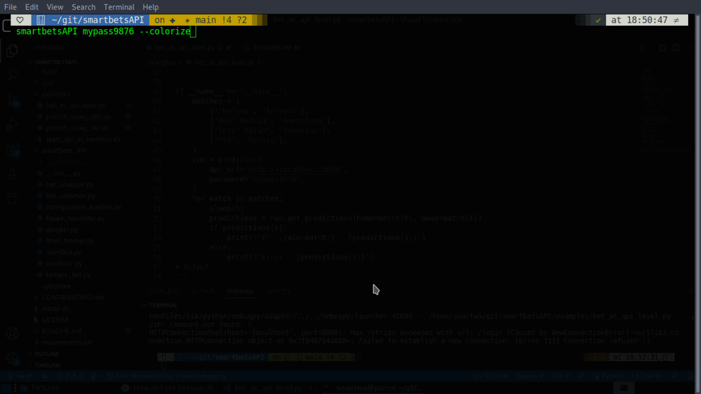

<h1 align="center">smartbetsAPI</h1>
<p align="center">
 <a href="https://github.com/Simatwa/smartbetsAPI"></a>
<a href="LICENSE"></a>
<a href="#"></a>
<a href="https://github.com/psf/black"></a>
<a href="#"></a>
<a href="#"></a>
<a href="#" alt="coverage"></a>
<a href="#" alt="progress"></a><br>
 <!-- <br><br> -->
</p>
 
 > "Punter's choice" 

 Worldwide soccer-matches predictor with a  dedicated standalone [Flask](https://github.com/pallets/Flask) server as an endpoint and a package for intergrating the scripts in your own [Python](https://python.org) code.

 ## Features
 - Standalone api
 - Script intergration (package)
 - Non-AI 

 ## Installation and usage

 ### Installation

1. Linux 

*Python 3.7+* is required for this script to be fruitful to you. 
- Installing through pip is always the most preferred way:

 ```sh
 $ pip  install smartbetsAPI
 
 ```

 - For those who like enjoying the **latest** releases from [Github](https://github.com) like [me](https://github.com/Simatwa), rather than  waiting for the next package:

 ```sh
 $ pip install git+https://github.com/Simatwa/smartbetsAPI.git

 ```

- The hard-core guys with _trust issues_ are very much sorted this way:

 ```sh

 $ git clone https://github.com/Simatwa/smartbetsAPI.git

 $ cd smartbetsAPI

 $ bash install.sh 

   #or

$ sudo bash install.sh

```

### Usage

1. Terminal

 Running `$ smartbetsAPI <api-password>`  will fire up the [Flask](/pallets/Flask) server with the following default configurations.

<table align="center"> 
<thead>
<tr><th>Command        </th><th>Default  </th></tr>
</thead>
<tbody>
<tr><td>Port           </td><td>8000     </td></tr>
<tr><td>Username       </td><td>API</td></tr>
<tr><td>Filename       </td><td>None     </td></tr>
<tr><td>level (Logging)</td><td>20       </td></tr>
<tr><td>host           </td><td>False    </td></tr>
<tr><td>debug          </td><td>False    </td></tr>
<tr><td>no-net         </td><td>False    </td></tr>
<tr><td>log            </td><td>False    </td></tr>
<tr><td>colorize       </td><td>False    </td></tr>
<tr><td>gui (Termux)   </td><td>False    </td></tr>
</tbody>
</table>

- For instance :

 ```sh
 $ smartbetsAPI mypass9876

``` 

Here is an example of a [simple program](examples/bet_at_api_level.py) that makes prediction using the `api`.




> **Note** 
  - Content-Type of the response (predictions) is `application/json`


* For more information you can run `smartbetsAPI -h` 


2. Importing Package

Module `predictor`  provides two ways of interacting with it at the programming level, based on the `data-type` in which the teams have been packed and parsed to it:

* Using `predictorL` object which accepts *teams* (**List** data-type).
> For [example](examples/predict_using_list.py):

```py
#!usr/bin/env python3
from smartbets_API.predictor import predictor

teams = [
    "Napoli",  # Home team (index [0])
    "AC Milan",  # Away team (index [1])
]
# Instantiating predictor
predict = predictor()

# Using predictorL object to handle teams (List data-type)
predictions = predict.predictorL(teams)

# Display info
print(predictions)

#Output
#{'g': 8.0, 'gg': 65.0, 'ov15': 70.0, 'ov25': 40.0, 'ov35': 30.0, 'choice': 60.0, 'result': '2', 'pick': 'ov15'}

```

* Using `predictorD` object which takes *teams* (**Dictionary** data-type):
> For [example](examples/predict_using_dict.py):

```py
#!usr/bin/env python3
from smartbets_API.predictor import predictor

teams = {
    1: "Manchester City",  # 1 for home-team
    2: "Liverpool",  # 2 for away-team
}

# Instantiating predictor
predict = predictor()

# Using predictorD object to handle teams (Dictionary data-type)
predictions = predict.predictorD(teams)

# Display info
print(predictions)

#Output
#{'g': 8.0, 'gg': 65.0, 'ov15': 60.0, 'ov25': 45.0, 'ov35': 30.0, 'choice': 56.16, 'result': '1', 'pick': 'gg'}

```

- The outputs initials are explained in the table below

<table>
<thead>
<tr><th>Parameter  </th><th>Function                                                 </th></tr>
</thead>
<tbody>
<tr><td>g          </td><td>Goal average of the two teams                              </td></tr>
<tr><td>gg         </td><td>Probability of both teams to score                         </td></tr>
<tr><td>ov15       </td><td>Probability of having more than 2 goals                    </td></tr>
<tr><td>ov25       </td><td>Probability of having more than 3 goals                    </td></tr>
<tr><td>ov35       </td><td>Probability of having more than 4 goals                    </td></tr>
<tr><td>choice     </td><td>Probability of the specified &#x27;result&#x27; to occur            </td></tr>
<tr><td>result     </td><td>The most suitable outcome from [1,1x,x,2x,2]                  </td></tr>
<tr><td>pick       </td><td>The most suitable outcome from [1,1x,x,2x,2,gg,ov15,ov25,ov35]</td></tr>
</tbody>
</table>

> **Note** 
  - Probabilities are in percentange (%)

#### Further info 

The `predictor` _class_ accepts multiple parameters that includes :

<table>
<thead>
<tr><th>Parameter       </th><th>Function                                              </th><th>Default  </th></tr>
</thead>
<tbody>
<tr><td>include_position</td><td>Include team&#x27;s league ranking in making predictions     </td><td>False    </td></tr>
<tr><td>log             </td><td>Log at api default log&#x27;s path                           </td><td>False    </td></tr>
<tr><td>level           </td><td>Logging level                                           </td><td>0        </td></tr>
<tr><td>filename        </td><td>Log to the filename specified                           </td><td>None     </td></tr>
<tr><td>color           </td><td>Colorize the logs                                       </td><td>False    </td></tr>
<tr><td>gui             </td><td>Run with some Graphical interface notifications (Termux)</td><td>False    </td></tr>
<tr><td>api             </td><td>Run with api-server&#x27;s configurations                    </td><td>False    </td></tr>
</tbody>
</table>

The two predictor's object (`predictorD`, `predictorL`) accepts two parameters i.e.
* **teams** - Required
* **net** - Source of team's data - Default `True` (Online)

## Source of data

Team performances are sourced from [Soccerway](https://int.soccerway.com) after souping the *uri* from [Google](https://www.google.com).

> **Warning** Copyright related issues are liable to the user of this script!

## Disclaimer

This project aims to help *punters* and *bookmarkers* to make informed and well researched soccer-predictions. Nevertheless, it is important to specify that 100% accuracy does not exist and smartbetsAPI can't guarantee the accuracy of the predictions. It is therefore your responsibility to trust the information conveyed by the smartbetsAPI after evaluating its reliability. As the [creator](https://github.com/Simatwa), I **CANNOT** be held responsible for any loss of capital that may occur during the use of this program.

## Contributing and Support

### Contributing

Contributions are always welcome! <br>
Please take a look at the [Contribution guidelines](CONTRIBUTING.md). <br>
Feel free to open an [Issue](https://github.com/Simatwa/smartbetsAPI/issues) or to [Fork](https://github.com/Simatwa/smartbetsAPI/fork) this repo.

### ToDo

- [ ] Upgrade to Machine learning
- [ ] Improve algorithim's accuracy
- [ ] General code improvements
- [ ] Fix bugs

### Support 

Consider donating to this project if you find it useful:
<p align="center">
<a href="https://www.paypal.com/donate/?hosted_button_id=KLNYKSGUXY8R2"></a>
</p>

## Credits

- [x] [Soccerway](https://int.soccerway.com)
- [x] [Google](https://www.google.com)
- [x] [Python.org](https://python.org)

## Special Thanks

* [x] [victhepythonista](https://github.com/victhepythonista)
* [x] YOU.
